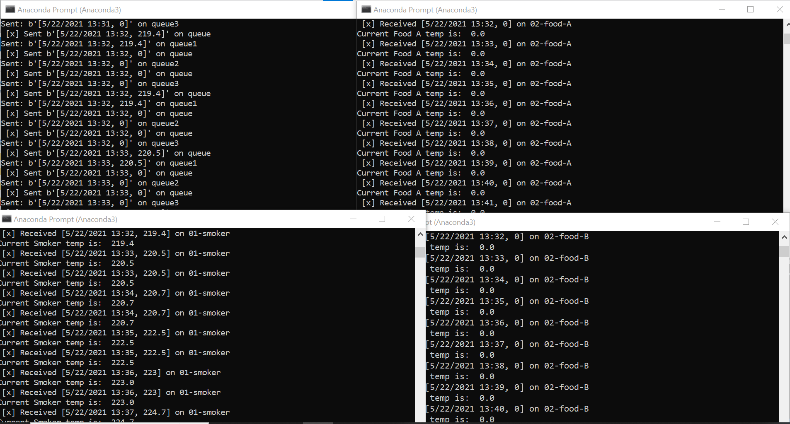
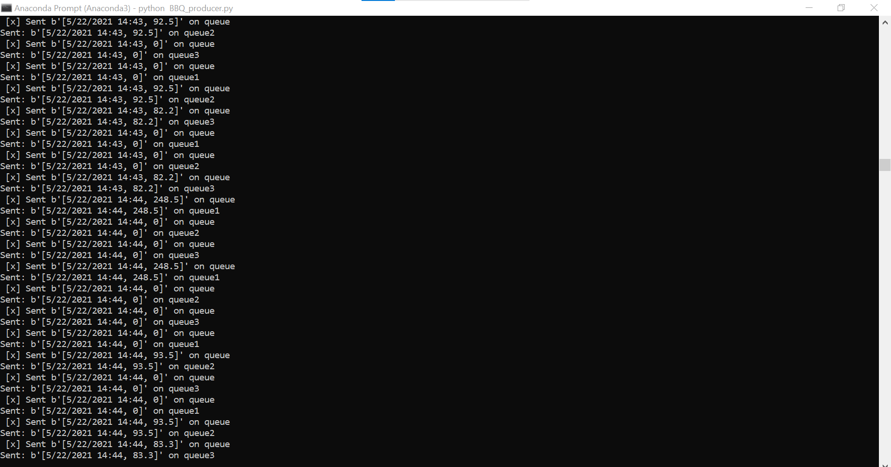
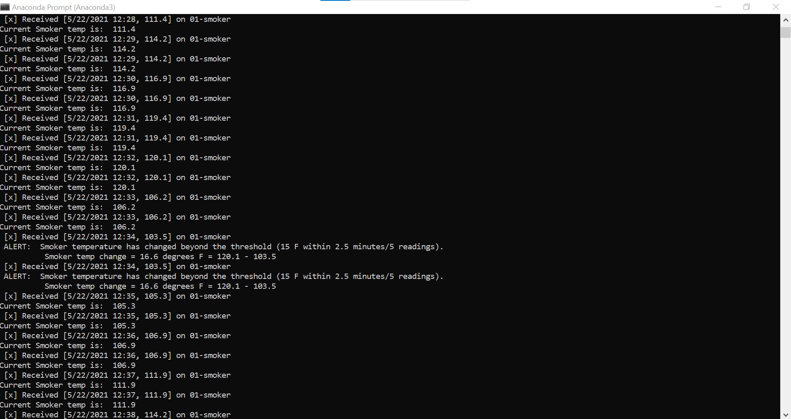
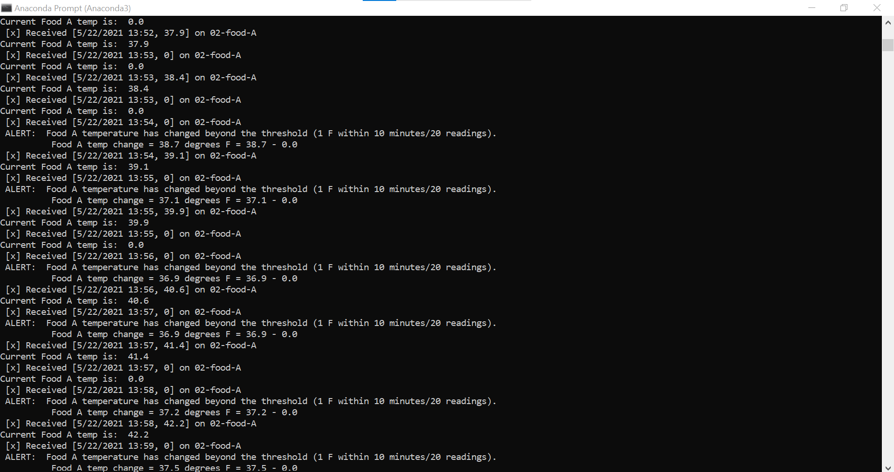
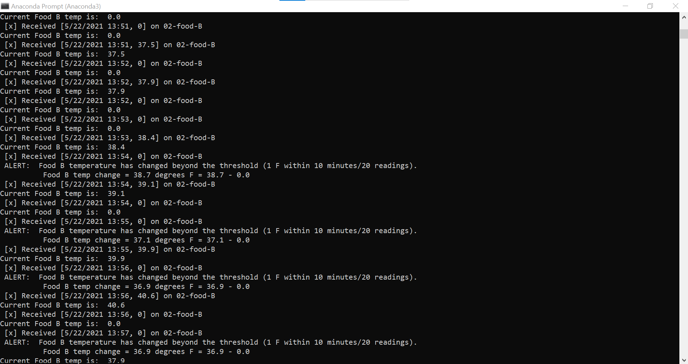
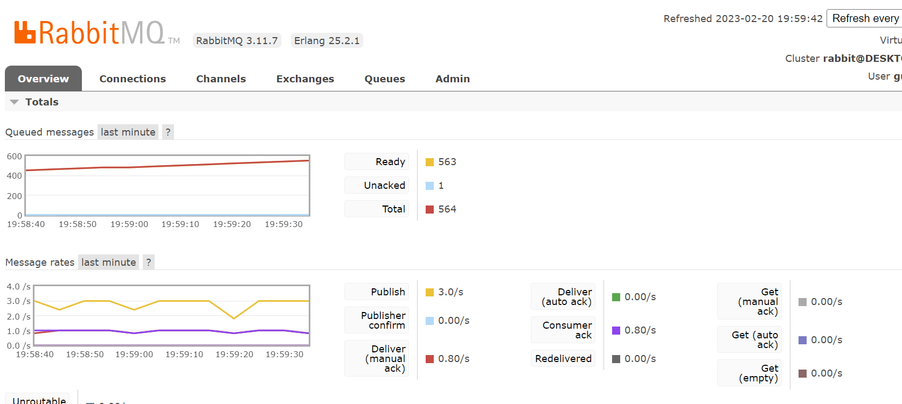
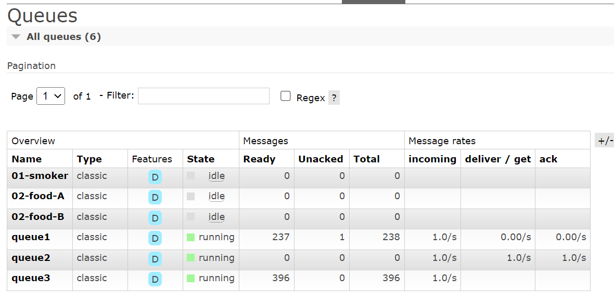

# Eden Anderson
## Streaming Data 44671 / Module 6 Assignment

# -streaming-06-smart-smoker
Streaming Data 44671 Module 6 / Creating a Producer

# The Problem / Challenge To Solve

## Using a Barbeque Smoker
When running a barbeque smoker, we monitor the temperatures of the smoker and the food to ensure everything turns out tasty. Over long cooks, the following events can happen:

1. The smoker temperature can suddenly decline.
1. The food temperature doesn't change. At some point, the food will hit a temperature where moisture evaporates. It will stay close to this temperature for an extended period of time while the moisture evaporates (much like humans sweat to regulate temperature). We say the temperature has stalled.
 
## Sensors
We have temperature sensors track temperatures and record them to generate a history of both (a) the smoker and (b) the food over time. These readings are an example of time-series data, and are considered streaming data or data in motion.

## Streaming Data
Our thermometer records three temperatures every thirty seconds (two readings every minute). The three temperatures are:

1. the temperature of the smoker itself.
1. the temperature of the first of two foods, Food A.
1. the temperature for the second of two foods, Food B.

## Assignment Tasks

# Smart Smoker System
* Read about the Smart Smoker system here: Smart Smoker - DONE
* We read one value every half minute. (sleep_secs = 30) - DONE

smoker-temps.csv has 4 columns:

1. Time = Date-time stamp for the sensor reading
1. Channel1 = Smoker Temp --> send to message queue "01-smoker"
1. Channel2 = Food A Temp --> send to message queue "02-food-A"
1. Channel3 = Food B Temp --> send to message queue "02-food-B"

We want know if:

1. The smoker temperature decreases by more than 15 degrees F in 2.5 minutes (smoker alert!)
1. Any food temperature changes less than 1 degree F in 10 minutes (food stall!)

Time Windows

* Smoker time window is 2.5 minutes
* Food time window is 10 minutes

Deque Max Length

* At one reading every 1/2 minute, the smoker deque max length is 5 (2.5 min * 1 reading/0.5 min)
* At one reading every 1/2 minute, the food deque max length is 20 (10 min * 1 reading/0.5 min) 

Condition To monitor

* If smoker temp decreases by 15 F or more in 2.5 min (or 5 readings)  --> smoker alert!
* If food temp change in temp is 1 F or less in 10 min (or 20 readings)  --> food stall alert!

Requirements

* RabbitMQ server running - DONE
* pika installed in your active environment - DONE

RabbitMQ Admin

* See http://localhost:15672/Links to an external site. - DONE

General Design 

1. How many producer processes do you need to read the temperatures: One producer, built last project.
1. How many listening queues do we use: three queues, named as listed above.
1. How many listening callback functions do we need (Hint: one per queue): Three callback functions are needed.
 

# Task 1. Open Your Existing Project
1. On your machine, open your existing streaming-05-getting-started repo in VS Code. - DONE
1. Create a file for your consumer (or 3 files if you'd like to use 3 consumers). - DONE
 

# Task 2. Design and Implement Each Consumer
1. Design and implement each bbq consumer. You could have one. You could have 3.  More detailed 1. help provided in links below. - DONE
1. Use the logic, approach, and structure from prior modules (use the recommended versions). - DONE
1. Modifying them to serve your purpose IS part of the assignment. - DONE
1. Do not start from scratch - do not search for code - do not use a notebook. - DONE
1. Use comments in the code and repo to explain your work. - DONE
1. Use docstring comments and add your name and date to your README and your code files. - DONE
 

# Task 3. Professionally Present your Project
1. Explain your project in the README.
1. Include your name, date.
1. Include prerequisites and how to run your code. 
1. Explain and show how your project works. 
1. Tell us what commands are needed. Use code fencing in GitHub or backtics for inline code to 1.share commands.
1. Display screenshots of your console with the producer and consumer running.
1. Display screenshots of at least one interesting part of the RabbitMQ console. 

# More Guidance
* To be guided through the consumer design, read Module 6.1: Guided Consumer Design
* For guidance on consumer implementation, read Module 6.2: Guided Consumer Implementation
* For guidance on implementing a consumer callback, read Module 6.3: Implementing a Callback Function
* Use the discussion forum when you get stuck.
* Try to help without giving away code. 

# Project Details
* I started with my Module 5 git repository as the base for the producer, and I copied it into a new Module 6 repository.
* After that, I used a consumer python file from Module 4 as a base to build on.  I was able to maintain most of the structure, but I did need to add the deque files and variables.
* The hardest part for me was creating the code that would generate an alert when conditions were met.  To do so, I used the predefined variables and set up an if statement that produced a print() alert if the if statement was met.
* Once I had one working consumer, I basically copied it twice more, editing the variables and queues as appropriate.

# Requirements
In your callback function, make sure you generate alerts - there will be a smoker alert and both Food A and Food B will stall. - DONE

Your README.md screenshots must show 4 concurrent processes: (SEE BELOW)

1. Producer (getting the temperature readings) - A6_producer_py.png
1. Smoker monitor - A6_consumer_smoker_py.png
1. Food A monitor - A6_consumer_FoodA_py.png
1. Food B monitor - A6_consumer_FoodB_py.png
In addition, you must show at least 3 significant events.

Run each terminal long enough that you can show the significant events in your screenshots:

1. Visible Smoker Alert with timestamp - A6_consumer_smoker_py.png
1. Visible Food A stall with timestamp - A6_consumer_FoodA_py.png
1.  Food B stall with timestamp - A6_consumer_FoodB_py.png

## Screenshots

# Concurrent processes

# Producer Screenshot

# Smoker with timestamp and alert

# Food A with timestamp and alert

# Food B with timestamp and alert

# RabbitMQ Screenshots

